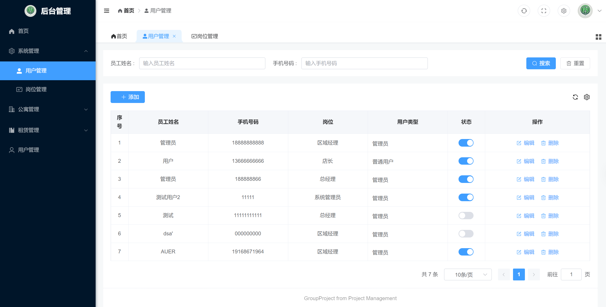
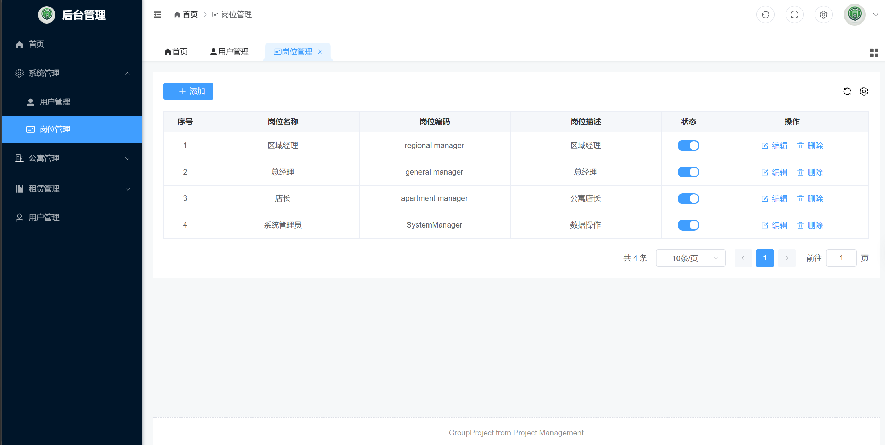
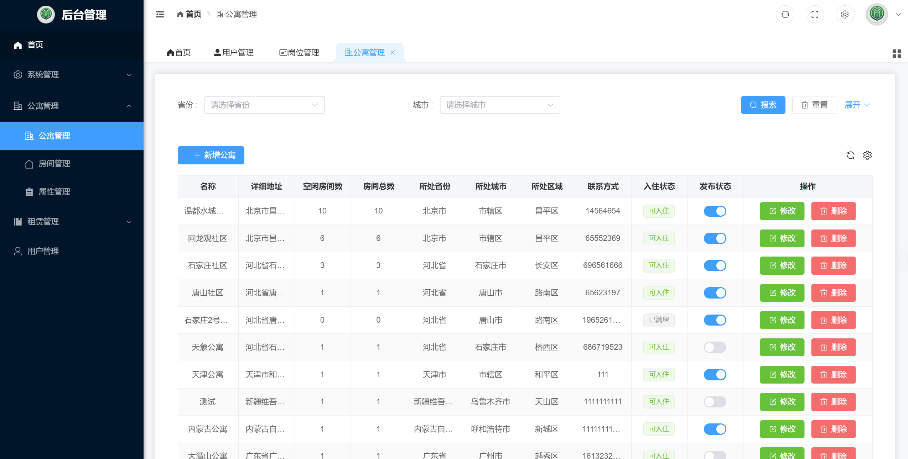
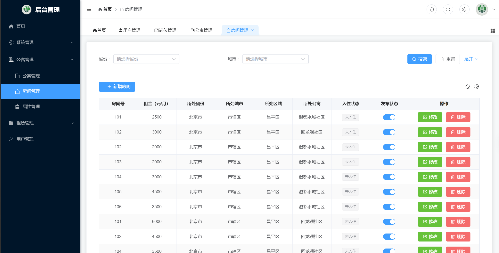
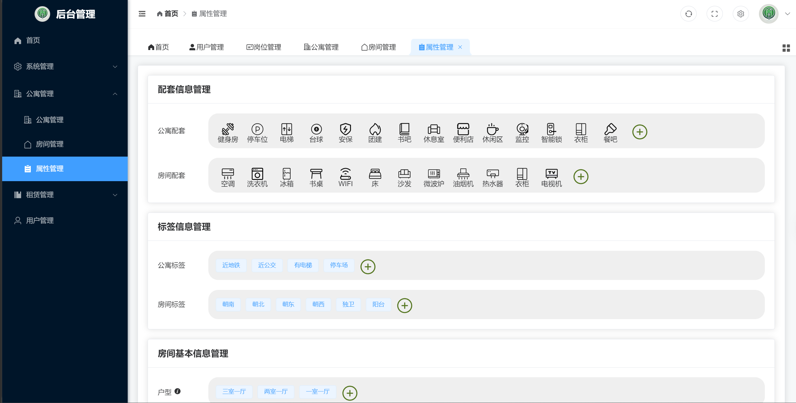
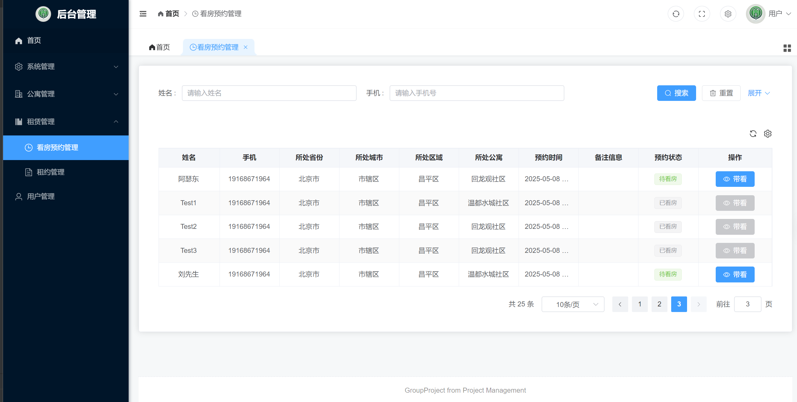
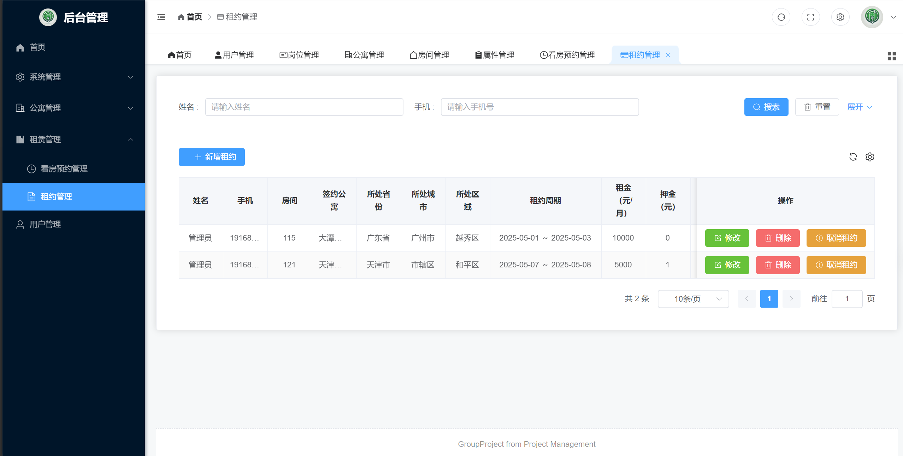
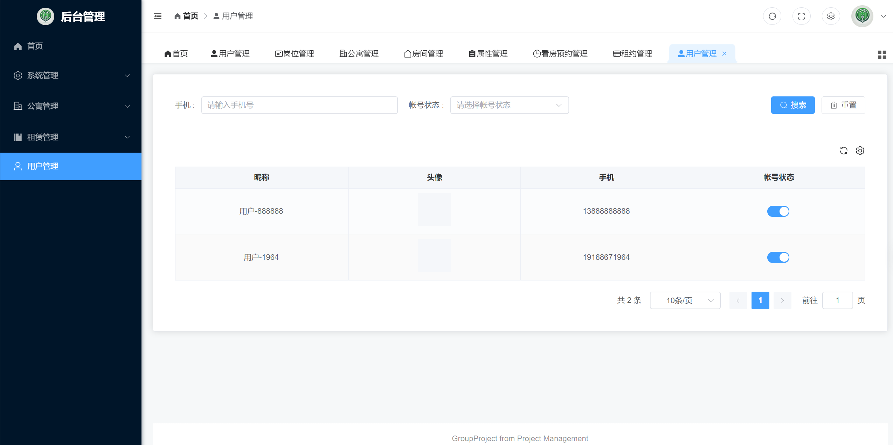

## **Project Background**

Lease Management System  is a rental platform project that includes both a mobile application and a backend management system.

The mobile application is designed for general users, offering features such as apartment search, viewing appointment booking, and lease management.

The backend management system is intended for administrators, providing functionalities like apartment (property) management, rental management, and user management.

----------------------------------------------------------------------------------------------------
## **Functional Modules**

The detailed content of each functional module is as follows:

Apartment Information Management
This module is responsible for managing all basic information related to apartments, including apartment names, addresses, and contact details. Administrators can add, edit, and delete apartment information here.

Room Information Management
This module is used to manage detailed information for each room within an apartment, including room numbers, types, sizes, and rental prices. Administrators can add, edit, and delete room information here.

Apartment/Room Attribute Management
This module allows administrators to define various attributes for apartments and rooms, such as amenities and facilities, to simplify the maintenance and selection of apartment and room information.

Viewing Appointment Management
This module is designed for managing user viewing appointment requests. Users can submit viewing requests through the mobile application, and administrators can review and process these requests in the backend management system to ensure efficient scheduling.

Lease Management
This module handles the creation, modification, and termination of lease agreements. Administrators can generate lease contracts here and send them to tenants for signature.

Backend System User Management
This module is used to manage user accounts for the backend system. Administrators can create, edit, delete, enable, and disable user accounts as needed.

Mobile User Management
This module is responsible for managing user information for the mobile application. Administrators can view user profiles and handle related account issues.

## **Feature Showcase**
Login Page

System Management

Apartment Management

Lease Management

User Management

-------------------------------------------------------------------

## **Mobile Client**

## **Functional Modules**
The detailed content of each functional module is as follows:

Login
Utilizes Alibaba Cloud API for SMS-based verification to provide secure and convenient login for users.

Property Search
Users can use this feature to search and filter available rental listings based on their specific requirements. They can quickly find suitable apartments by specifying criteria such as location, rent range, payment methods, and more.

Viewing Appointment Management
This feature allows users to schedule property viewings at their convenience. They can select a suitable time to visit specific apartments, helping them better understand the property’s condition and surroundings before making a decision.

Lease Management
This feature enables users to view and manage their lease agreements. They can access their lease contracts through the mobile app and submit requests for contract termination or extension as needed.

Property Browsing History
Users can view their previously browsed properties in this section. This feature helps users keep track of apartments they have shown interest in, making it easier for them to revisit listings or make final decisions.

